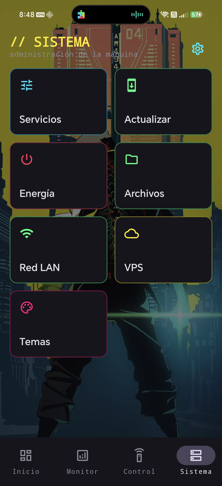
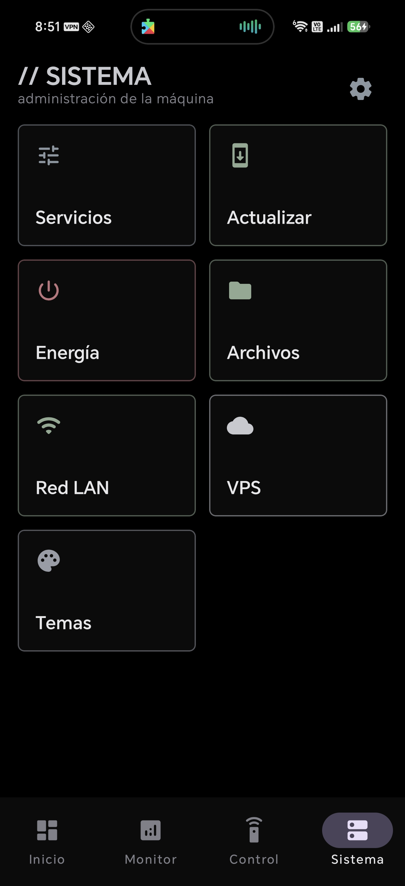
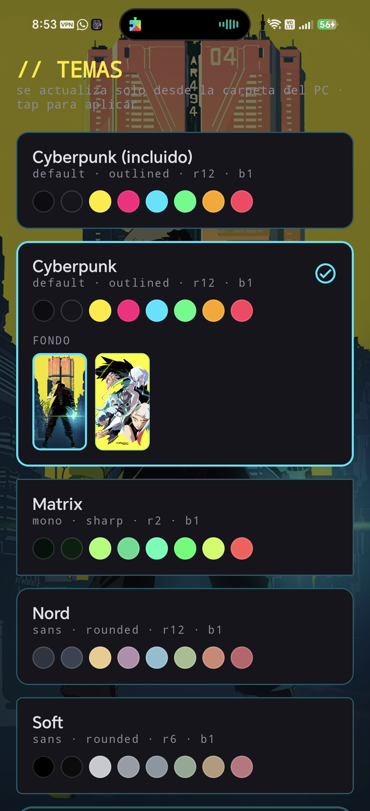
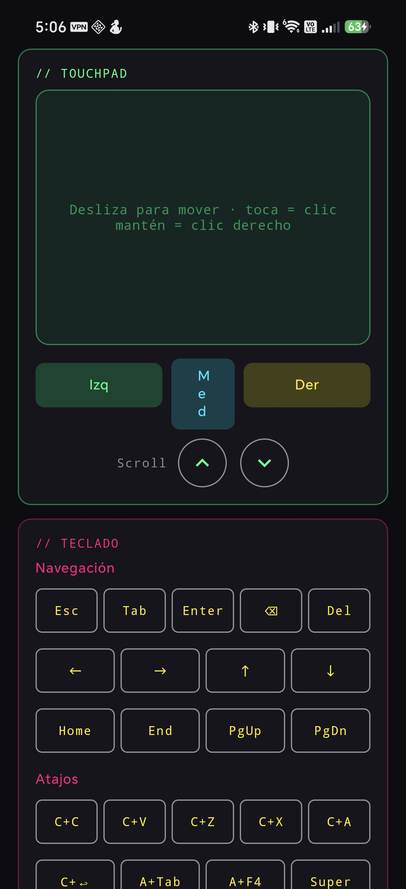
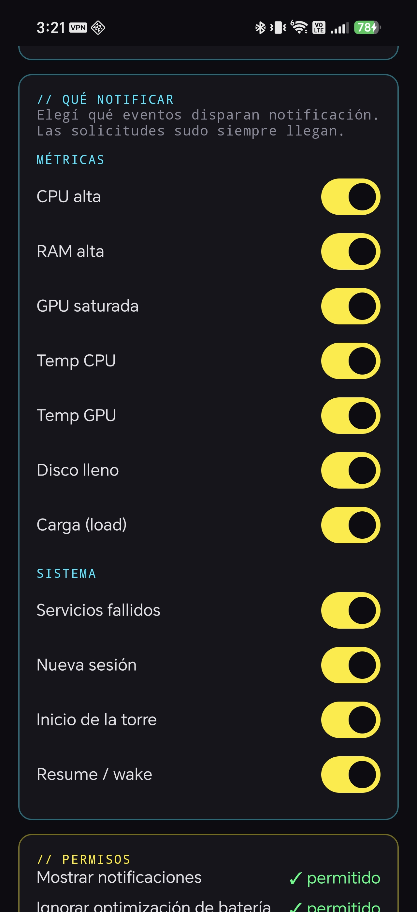

# Panda Control

> Panel Android para **monitorear y controlar tu PC Linux desde el celular**,
> hablando directo con la máquina a través de tu propia red privada de
> [Tailscale](https://tailscale.com/). Sin nube, sin servidores de terceros,
> sin telemetría.

```
┌─────────────────┐        Tailscale (WireGuard)        ┌───────────────────┐
│     Android     │ ◄──────────────────────────────────►│    PC Linux       │
│  Panda Control  │          HTTP REST + SSE             │ apppanda-backend  │
│   (Kotlin/CMP)  │            (puerto 8890)             │  (daemon Python)  │
└─────────────────┘                                      └───────────────────┘
```

## ¿Qué es esto?

Panda Control son **dos piezas** que trabajan juntas:

1. **El backend** (`backend/`) — un daemon escrito en Python puro (solo la
   librería estándar) que corre como servicio `systemd` en tu PC Linux.
   Expone una API HTTP REST + un stream de eventos en tiempo real (SSE) que
   reportan el estado de la máquina y permiten ejecutar acciones sobre ella.

2. **La app** (`android/`) — una aplicación Android (Kotlin + Jetpack
   Compose, tema cyberpunk) que se conecta a ese backend y te da un panel
   completo en el celular.

Las dos piezas se hablan **únicamente por tu tailnet de Tailscale**: una red
privada cifrada punto a punto. El celular nunca expone tu PC a internet y no
hay ningún intermediario en la nube. Si tu celular está en tu tailnet, ve tu
PC; si no, no existe para nadie más.

> **Plataforma:** la rama `main` apunta a **Linux**. El backend depende de
> `systemd`, `polkit` y utilidades propias de Linux. El soporte para Windows
> llegará en su propia rama — ver [Roadmap](#roadmap).

## Qué puedes hacer desde el celular

| Módulo | Para qué sirve |
|---|---|
| **Status** | CPU, RAM, disco, red, temperaturas, GPUs y estado SMART en vivo. |
| **Trends** | Gráficas históricas 1h / 6h / 24h, dibujadas nativamente en Canvas. |
| **Media** | Control MPRIS (play/pausa, seek ±15s, fullscreen del video), **volumen maestro del sistema + silenciar** (slider, vía `pactl`), cambiar el sink de audio, prender/apagar pantallas (DPMS), lanzar apps GUI, lanzar juegos de Steam y comandos del WM `niri` desde una whitelist estricta. |
| **Control** | Mouse y teclado remotos: un **touchpad** que mueve el cursor por deltas, clic izquierdo/medio/derecho, scroll de dos dedos y swipe horizontal de dos dedos para navegar atrás/adelante, teclas especiales y atajos (Esc, Tab, flechas, Ctrl+C/V/Z, Alt+Tab, etc.), escritura de texto libre y **portapapeles bidireccional** (traer del PC / enviar al PC, vía `wl-clipboard`). Mouse vía `ydotool`, teclado vía `wtype`. |
| **Sistema** | Apagar / reiniciar / suspender / bloquear (con confirmación), listar y matar procesos, gestionar servicios (start/stop/restart), ver logs de `journalctl`, revisar y aplicar actualizaciones (`checkupdates`), ver vecinos de la LAN y consultar tus VPS por SSH. |
| **Archivos** | Gestor completo de los directorios que compartas: navegar subcarpetas (con breadcrumb), descargar al celular, subir a la carpeta actual, crear carpeta, renombrar, borrar (archivos y carpetas, con confirmación) y abrir cualquier archivo/carpeta en el PC con su app por defecto (`xdg-open`). Anti path-traversal: todo queda confinado al `shared_dir`. |
| **Temas** | Cambiar el look completo de la app: cada tema es un paquete que define **colores, fuente, estilo de iconos, formas/bordes y fondos opcionales** (imágenes de la misma carpeta; si hay varias, eliges con qué wallpaper aplicar el tema). Los temas viven como archivos `*.json` en una carpeta del PC (`[themes].dir`); la app los lista y aplica al vuelo. Para agregar un tema basta dejar un `.json` nuevo — no hay que recompilar. Incluye *Cyberpunk* (default), *Synthwave*, *Matrix*, *Nord* y *Soft* (AMOLED). |
| **Push del sistema** | Un `ForegroundService` mantiene el SSE vivo en segundo plano y dispara notificaciones nativas ante alertas con histéresis (CPU/RAM/disco/temps/GPU/carga), servicios caídos, sesiones nuevas, boot o salida de suspensión. |
| **Aprobación de sudo remota** | Cuando tu PC necesita privilegios de root, el celular recibe una notificación urgente (con vibración y tono disparados a mano para sobrevivir al modo silencioso de OEMs como Honor o Xiaomi). El modal muestra el comando que se va a ejecutar; para **aprobar** te pide confirmar tu identidad con **huella** (o el PIN/patrón del dispositivo), mientras que rechazar es directo. |

## Capturas

> Los wallpapers que se ven de fondo **no están incluidos en el repo** por
> derechos de autor; aparecen solo a modo de demostración. La app trae los
> temas (colores, fuentes, formas), pero tú pones tus propias imágenes de fondo.

<table>
  <tr>
    <td align="center" width="33%">
      <br>
      <sub>Sistema · tema Cyberpunk con fondo</sub>
    </td>
    <td align="center" width="33%">
      <br>
      <sub>Sistema · tema sobrio sin fondo</sub>
    </td>
    <td align="center" width="33%">
      <br>
      <sub>Temas · cambia el look al vuelo</sub>
    </td>
  </tr>
  <tr>
    <td align="center" width="33%">
      <br>
      <sub>Control · touchpad + teclado remotos</sub>
    </td>
    <td align="center" width="33%">
      <br>
      <sub>Notificaciones · qué eventos te avisan</sub>
    </td>
    <td width="33%"></td>
  </tr>
</table>

## Requisitos previos

**En el PC (para el backend):**

- Linux con `systemd`.
- **Python 3.11 o superior** (el daemon usa solo la librería estándar).
- **Tailscale** instalado y conectado a tu tailnet.
- *Opcionales*, según las funciones que quieras usar: `lm_sensors` (temps),
  `smartmontools` (SMART), `pacman-contrib` (`checkupdates`), `pactl`
  (audio: sinks + volumen/mute), `niri` (control del WM), `playerctl` (MPRIS),
  `wtype` (teclado / inyección de teclas), `ydotool` (mouse), `wl-clipboard`
  (portapapeles) y `polkit` (acciones que requieren privilegios). El daemon
  arranca igual aunque falte cualquiera de estos; solo se desactiva la función
  correspondiente.
- *Para el módulo Control* (mouse): `ydotool` con su daemon `ydotoold`
  corriendo. La forma cómoda es como servicio de usuario:
  `systemctl --user enable --now ydotoold`. El daemon crea su socket en
  `$XDG_RUNTIME_DIR/.ydotool_socket`, donde `ydotool` lo encuentra solo.
  Necesita acceso a `/dev/uinput` (típicamente sumando tu usuario al grupo
  `input`). El teclado usa `wtype`, que no necesita daemon.

**Para compilar la app:**

- **JDK 17 o superior** (recomendado 21).
- **Android SDK 35**.
- Un celular con **Android 8.0 (API 26) o superior** y Tailscale instalado.

---

## Instalación paso a paso (Linux)

### 1. Conecta tu PC y tu celular a Tailscale

Si todavía no usas Tailscale, instálalo en ambos dispositivos y entra con la
misma cuenta. En el PC:

```bash
# Ejemplo en Arch / CachyOS — usa el gestor de tu distro
sudo pacman -S tailscale
sudo systemctl enable --now tailscaled
sudo tailscale up
```

Instala también la app de Tailscale en el celular y entra con la misma
cuenta. Anota la **IP Tailscale de tu PC** (empieza con `100.`):

```bash
tailscale ip -4
# p. ej. 100.64.0.5
```

### 2. Clona el repositorio

```bash
git clone https://github.com/PandaAkiraNakai/PandaControl.git
cd PandaControl
```

### 3. Instala el backend

El instalador es idempotente: copia el daemon a `/usr/local/bin`, crea el
servicio `systemd`, la regla de `polkit`, los directorios de estado y log, y
deja una config de ejemplo. **No pisa tu config si ya existe.**

```bash
cd backend
sudo bash INSTALL.sh
```

Esto deja instalado:

| Ruta | Qué es |
|---|---|
| `/usr/local/bin/apppanda-backend` | El daemon. |
| `/etc/apppanda-backend/config.toml` | Tu configuración (permisos `0400`). |
| `/etc/systemd/system/apppanda-backend.service` | El servicio systemd. |
| `/var/lib/apppanda-backend/metrics.db` | SQLite con el histórico de métricas. |
| `/var/log/apppanda-backend/audit.log` | Registro de auditoría (append-only). |

### 4. Genera un token de acceso

```bash
python -c "import secrets; print(secrets.token_hex(32))"
```

Copia el valor que imprime (64 caracteres hexadecimales). Lo necesitarás en
el siguiente paso y al configurar la app.

### 5. Edita la configuración

```bash
sudo -u $USER $EDITOR /etc/apppanda-backend/config.toml
```

Como mínimo, configura el bind y el token:

```toml
[http]
enabled = true
host = "100.64.0.5"          # ← la IP Tailscale de TU PC (paso 1)
port = 8890
tokens = ["<pega aquí el token del paso 4>"]
```

> ⚠️ **Nunca uses `host = "0.0.0.0"`.** Aunque la API tuviera todo en modo
> solo-lectura, expondría procesos, journal y métricas a toda tu red. Usa
> siempre la IP de Tailscale (`100.x.y.z`), o `127.0.0.1` mientras pruebas
> localmente.

Más abajo, en [Configuración](#configuración), están las secciones
opcionales (archivos compartidos, VPS, SMART, etc.).

### 6. Arranca el servicio y verifica

```bash
sudo systemctl start apppanda-backend
sudo journalctl -fu apppanda-backend     # mira los logs en vivo (Ctrl-C para salir)
```

En otra terminal, comprueba que responde:

```bash
curl http://127.0.0.1:8890/api/v1/health
```

Si todo está bien, déjalo habilitado para que arranque con el sistema:

```bash
sudo systemctl enable apppanda-backend
```

### 7. Compila la app Android

```bash
cd ../android
./gradlew assembleDebug
```

El APK queda en `app/build/outputs/apk/debug/app-debug.apk`.

> `gradle.properties` apunta `org.gradle.java.home` a un JDK 21. Si el tuyo
> está en otra ruta, edita esa línea.

Para una **build de release firmada**, copia `keystore.properties.example` a
`keystore.properties`, rellénalo, genera el keystore y compila:

```bash
keytool -genkey -v -keystore apppanda-release.jks \
  -keyalg RSA -keysize 4096 -validity 36500 -alias apppanda
./gradlew assembleRelease
```

(El keystore y `keystore.properties` están en `.gitignore` — nunca los subas
al repo.)

### 8. Instala el APK en el celular

Con el celular conectado por USB y la depuración habilitada:

```bash
adb install app/build/outputs/apk/debug/app-debug.apk
```

O sube el APK a tu nube/Telegram, descárgalo en el celular e instálalo a mano
(tendrás que permitir "instalar apps de orígenes desconocidos").

### 9. Conecta la app al backend

1. Abre **Panda Control**, ve a la pestaña **Sistema** y toca el engranaje
   (**Ajustes**) arriba a la derecha.
2. Rellena:
   - **Host**: la IP Tailscale de tu PC (p. ej. `100.64.0.5`).
   - **Puerto**: `8890`.
   - **Bearer token**: el del paso 4 (también está en `config.toml`).
3. Toca **Probar conexión** — debe responder algo como
   `OK · <hostname> · 16 cores · 30 GB RAM`.
4. Toca **Guardar y entrar**.

> Para que esto funcione, el celular tiene que estar conectado a Tailscale y
> el backend tiene que estar bindeado a la IP Tailscale (paso 5), no a
> `127.0.0.1`.

¡Listo! Ya tienes el panel funcionando.

---

## Autenticación

El backend acepta dos esquemas, ambos opcionales y combinables:

- **Identidad de Tailscale** (sin token): el backend ejecuta
  `tailscale whois --json <ip_del_peer>` y autoriza si el `LoginName` del
  usuario está en `allowed_logins`. La app no necesita token; basta con estar
  en tu tailnet con tu cuenta.

  ```toml
  [auth.tailscale]
  enabled = true
  allowed_logins = ["tu-usuario@github"]
  ```

  Para ver tu `LoginName`:
  `tailscale whois --json <tu_ip_tailscale> | jq .UserProfile.LoginName`

- **Bearer token**: header `Authorization: Bearer <hex>`. Útil fuera de
  Tailscale o para automatización. Es el esquema del paso 4–5.

`/api/v1/health` y `/api/v1/version` son siempre públicos.

## Configuración

Toda la configuración vive en `/etc/apppanda-backend/config.toml`. La
referencia comentada completa está en
[`backend/config/config.example.toml`](backend/config/config.example.toml).
Las secciones más útiles:

- **`[files]`** — `shared_dirs` define qué carpetas son accesibles desde el
  celular (descarga y subida). Solo se comparte lo que listes explícitamente.
- **`[themes]`** — `dir` es la carpeta de temas visuales (`*.json`). Cada tema
  define colores + `font` (default/sans/serif/mono) + `iconStyle`
  (outlined/filled/rounded/sharp) + `corner` y `border` (dp). La app los lista y
  aplica al vuelo; agregar un archivo basta, sin recompilar. El instalador
  siembra ejemplos (Cyberpunk, Synthwave, Matrix, Nord, Soft AMOLED).
- **`[vps.hosts]`** — alias SSH de VPS para ver su resumen desde la app.
- **`[smart]`** — discos a chequear con `smartctl`.
- **`[steam]`** — integración con la biblioteca de Steam y `gamescope`.
- **`[monitor]` / `[history]`** — frecuencia de muestreo y retención del
  histórico SQLite.

Después de cualquier cambio:
`sudo systemctl restart apppanda-backend`.

## Operación y mantenimiento

| Acción | Comando |
|---|---|
| Estado del servicio | `sudo systemctl status apppanda-backend` |
| Logs en vivo | `sudo journalctl -fu apppanda-backend` |
| Reiniciar | `sudo systemctl restart apppanda-backend` |
| Health check | `curl http://127.0.0.1:8890/api/v1/health` |
| Actualizar / reinstalar | `sudo bash backend/INSTALL.sh` |
| Desinstalar | `sudo bash backend/UNINSTALL.sh` |

## Estructura del repositorio

```
PandaControl/
├── backend/                      Daemon Python (HTTP + SSE)
│   ├── bin/                      apppanda-backend.py, http_server.py,
│   │                             input_control.py, sudo_broker.py,
│   │                             sudo-app-askpass.py
│   ├── config/                   service unit, config.example.toml,
│   │                             regla de polkit
│   ├── INSTALL.sh · UNINSTALL.sh
│   └── README.md                 detalle del backend
└── android/                      App Kotlin + Jetpack Compose
    ├── app/                      Material 3, Ktor, DataStore, Compose
    ├── build.gradle.kts · settings.gradle.kts
    └── README.md                 detalle de la app
```

## Endpoints de la API

<details>
<summary>Ver listado completo</summary>

```
GET  /api/v1/health · /version
GET  /api/v1/status/{system,disk,net,temps,gpu,smart}
GET  /api/v1/processes?sort=cpu|ram&limit=N
GET  /api/v1/services
GET  /api/v1/logs?priority=err&n=30
GET  /api/v1/metrics?range=1h|6h|24h
GET  /api/v1/audio/sinks   (incluye master: volumen % + mute del sink default)
GET  /api/v1/clipboard     (texto del portapapeles del PC)
GET  /api/v1/screens
GET  /api/v1/media/players  ·  /media/{player}/status
GET  /api/v1/net/neighbors
GET  /api/v1/vps  ·  /vps/{alias}/summary
GET  /api/v1/games  ·  /apps  ·  /updates
GET  /api/v1/themes  ·  /themes/image?name=FILE
GET  /api/v1/files[?dir=N&rel=SUBPATH]  ·  /files/download?dir=N&rel=SUBPATH&name=FILE
GET  /api/v1/events   (SSE: metric_tick / alert / service_failed /
                       session_new / boot / resume / sudo_request)

POST /api/v1/power/{off|reboot|suspend|lock}        X-Confirm: true
POST /api/v1/processes/{pid}/kill                   X-Confirm: true
POST /api/v1/services/{unit}/{start|stop|restart}   X-Confirm: true
POST /api/v1/updates/apply                          X-Confirm: true
POST /api/v1/audio/sink            {sink: "..."}
POST /api/v1/audio/volume          {pct: 0..150}
POST /api/v1/audio/mute            {state: "on"|"off"|"toggle"}
POST /api/v1/clipboard             {text: "..."}      (escribe al portapapeles)
POST /api/v1/screens/{output}/{on|off}
POST /api/v1/screens/dpms/{on|off}
POST /api/v1/niri/cmd/{cmd}[?output=NAME]
     (whitelist: fullscreen-window, close-window, maximize-column,
      focus-column-{left|right}, focus-workspace-{up|down},
      toggle-overview, media-workspace)
POST /api/v1/media/{player}/{play-pause|next|previous|seek:+15|seek:-15|fullscreen|vol-up|vol-down}
POST /api/v1/apps/{name}/launch
POST /api/v1/games/{appid}/launch
POST /api/v1/net/wake/{alias}
POST /api/v1/input/mouse/{move|click|scroll}  ·  /input/mouse/stream
POST /api/v1/input/{key|type}
POST /api/v1/files/upload          (headers X-Filename, X-Dir, X-Rel)
POST /api/v1/files/mkdir           {dir, rel, name}
POST /api/v1/files/rename          {dir, rel, name, new_name}
POST /api/v1/files/delete          {dir, rel, name, recursive}   X-Confirm: true
POST /api/v1/files/open            {dir, rel, name}    (xdg-open en el PC)
POST /api/v1/sudo/request                            (askpass broker)
GET  /api/v1/sudo/{rid}/wait?timeout=N
POST /api/v1/sudo/{rid}/decision   {approve: bool}    (huella en la app)
```

</details>

## Seguridad y diseño

- **Solo librería estándar** en el backend — un único daemon más un par de
  módulos. Nada que auditar de terceros.
- **Cero servicios externos, cero telemetría.** Tailscale es la única
  dependencia de red.
- **El daemon NO corre como root.** Las acciones destructivas usan reglas de
  `polkit` de alcance reducido.
- **Audit log append-only** (`chattr +a`, formato JSONL): toda acción queda
  registrada y el log no se puede reescribir.
- **Aprobación de sudo con biometría:** elevar privilegios desde el celular
  exige confirmar tu huella (o el PIN/patrón del dispositivo) en el modal, que
  además muestra el comando exacto que se va a ejecutar.
- **El bind por defecto es `127.0.0.1`**: hay que abrirlo explícitamente a la
  IP de Tailscale para usarlo desde el celular.

## Roadmap

- **Rama `windows`** *(planeada)* — portar el backend a Windows. El daemon
  actual depende de `systemd`, `polkit`, `journalctl`, `pactl`, `niri` y
  `checkupdates`, todos específicos de Linux; la rama adaptará el arranque
  como servicio (NSSM / Servicio de Windows), la recolección de métricas
  (WMI / PowerShell) y la elevación de privilegios. La app Android no
  cambia: habla el mismo protocolo HTTP/SSE contra cualquier backend.

## Licencia

MIT. Ver [LICENSE](LICENSE).
```
<!-- profile-excerpt -->
**Panel Android + backend Python** para controlar tu PC Linux desde el celu vía **Tailscale**. Kotlin/Compose con tema cyberpunk, Ktor 3 + SSE para push en vivo, ForegroundService para notifs en background. Daemon stdlib que expone REST/SSE bajo polkit narrow-scope: poder, kill, services, audio sinks + volumen/mute (pactl), portapapeles (wl-clipboard), pantallas niri + DPMS, MPRIS con seek±15/fullscreen, lanzar apps/juegos Steam, gestor de archivos (navegar/subir/bajar/renombrar/borrar/abrir, anti path-traversal), journal, updates `pacman`. Auth dual: identidad Tailscale (`tailscale whois`) o Bearer token. Cero servicios externos, cero telemetría. `// linux-control · phone-rig · tailnet-native`
<!-- /profile-excerpt -->
